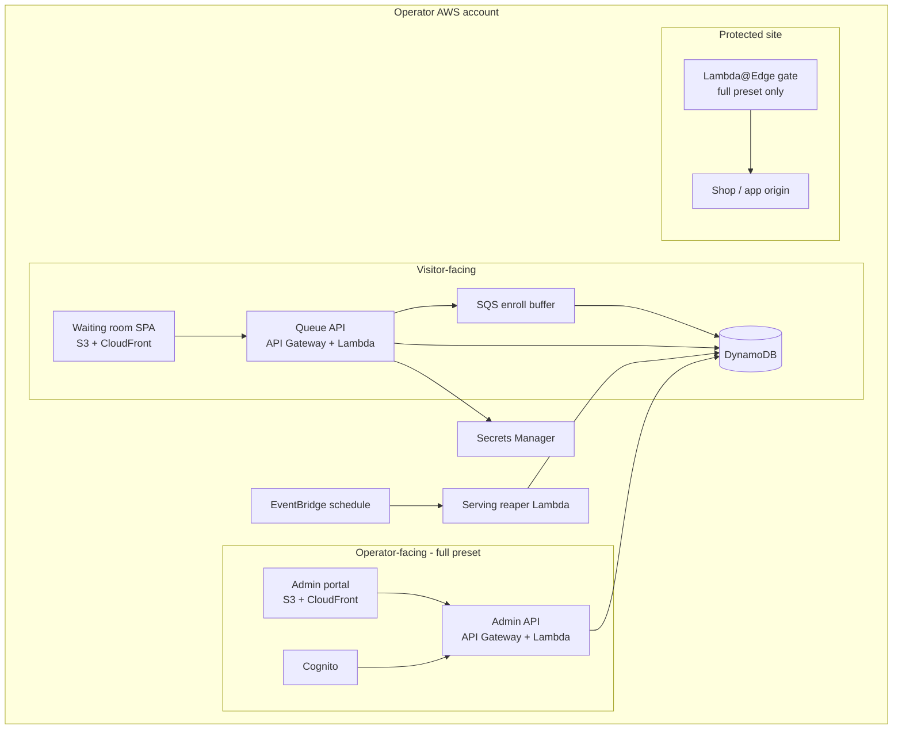
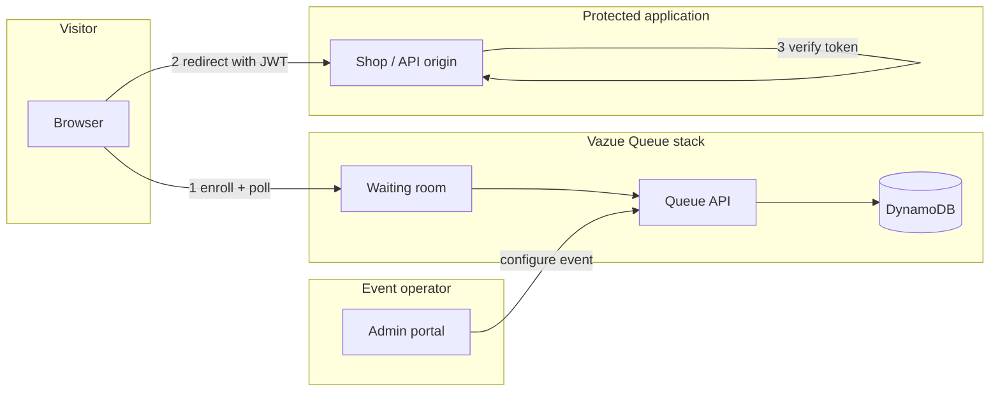
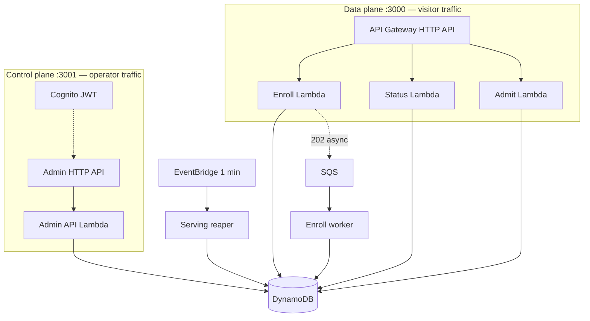
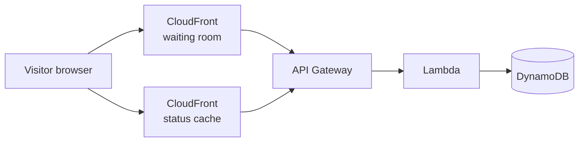
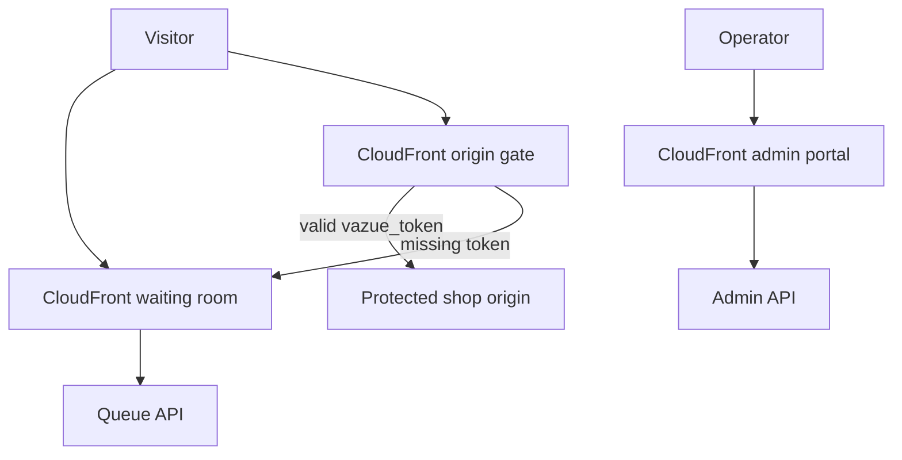

# Architecture

Vazue Queue is a **virtual waiting room** deployed on AWS. When flash traffic hits a site, visitors join a fair FIFO line, poll for their position, and receive a signed **admit token** (JWT) when it is their turn. The origin verifies that token before serving protected content.

This page describes **what runs in production** — the services in the AWS account, how they connect, and what each preset adds.

## Stack overview

Running `create-vazue-queue` and `cdk deploy` provisions a stack in the **operator AWS account** (default region `us-east-1`). The operator owns the data, billing, and configuration.

### What each piece does

| Component | Interaction | Purpose |
|-----------|-------------|---------|
| **Waiting room** | Visitor browser | Enroll UI, status polling, redirect with token |
| **Queue API** | Browser + backend services | `POST enroll`, `GET status`, optional `POST admit` |
| **DynamoDB** | Automatic | Visitors, positions, events, counters, tokens |
| **SQS enroll buffer** | Automatic | Absorb enroll bursts (202 + async write) |
| **Serving reaper** | Automatic | Advance serving counter every minute |
| **Admin portal** | Event operator | Create rooms/events, pause, throttle, CSV export |
| **Admin API** | Admin portal | Control plane on `:3001` locally |
| **Lambda@Edge** | Visitor to protected origin | Block origin without valid `vazue_token` |
| **Secrets Manager** | Deploy-time config | JWT signing key, Turnstile secret |

Published npm packages: `@yiu/queue-cdk`, `create-vazue-queue`, `@yiu/queue-sdk`. The Rust Lambdas ship as CDK assets — no self-managed servers required.

## End-to-end: three actors

1. **Visitor** — joins the queue via waiting room, waits, gets admitted, lands on the protected site with `?vazue_token=…`
2. **Operator** — sets throughput, pauses the queue, opens floodgates during an event
3. **Origin** — verifies the admit JWT with `@yiu/queue-sdk` before serving protected pages

## Data plane vs control plane

| Plane | Local port | Auth | Endpoints |
|-------|------------|------|-----------|
| **Data** | `:3000` | Public (+ optional Turnstile on enroll) | `/enroll`, `/status`, `/admit` |
| **Control** | `:3001` | Cognito JWT (full preset) | `/v1/rooms`, `/v1/events`, live overrides |

Both expose `GET /health` and `GET /ready`.

## Network path by preset

### `standard` preset (recommended)

Status polls can be **edge-cached** (2–30s TTL per `request_id`) — less load on Lambda than polling the API directly.

### `full` preset (+ operator + origin gate)

## Components by preset

| Component | minimal | standard | full |
|-----------|:-------:|:--------:|:----:|
| API Gateway + Lambda + DynamoDB | ✓ | ✓ | ✓ |
| SQS enroll buffer (default on) | ✓ | ✓ | ✓ |
| CloudFront waiting room | | ✓ | ✓ |
| Admin API + Cognito | | | ✓ |
| Admin portal (S3 + CloudFront) | | | ✓ |
| WAF | | | ✓ |
| Lambda@Edge origin gate | | | ✓ |

See [Presets](/docs/concepts/presets) for when to choose each.

## AWS services bill of materials

| AWS service | Role in Vazue Queue |
|-------------|---------------------|
| **DynamoDB** (on-demand) | Visitors, events, counters, tokens, rooms |
| **API Gateway HTTP API** | Data-plane and admin routes |
| **Lambda** (Rust, arm64 default) | enroll, status, admit, enroll-worker, serving-reaper, admin-api |
| **SQS** | Enroll buffer queue |
| **EventBridge** | 1-minute schedule for serving reaper |
| **CloudFront** | Waiting room static assets; status path caching |
| **S3** | Waiting room + admin portal build artifacts |
| **Secrets Manager** | JWT signing key; optional Turnstile secret ARN |
| **Cognito** | Admin user pool (full preset) |
| **WAF** | Rate limiting (full preset) |
| **ACM + Route 53** | TLS certs and DNS for the queue domain |

Estimate cost: `npx vazue-queue cost --visitors 100000 --minutes 60` — see [AWS cost estimate](/docs/guides/cost) for scenarios and breakdown.

## Related

- [Visitor flow](/docs/concepts/visitor-flow) — sequence diagram of enroll → admit
- [Data model](/docs/concepts/data-model) — DynamoDB tables
- [Deploy with CDK](/docs/guides/deploy)
