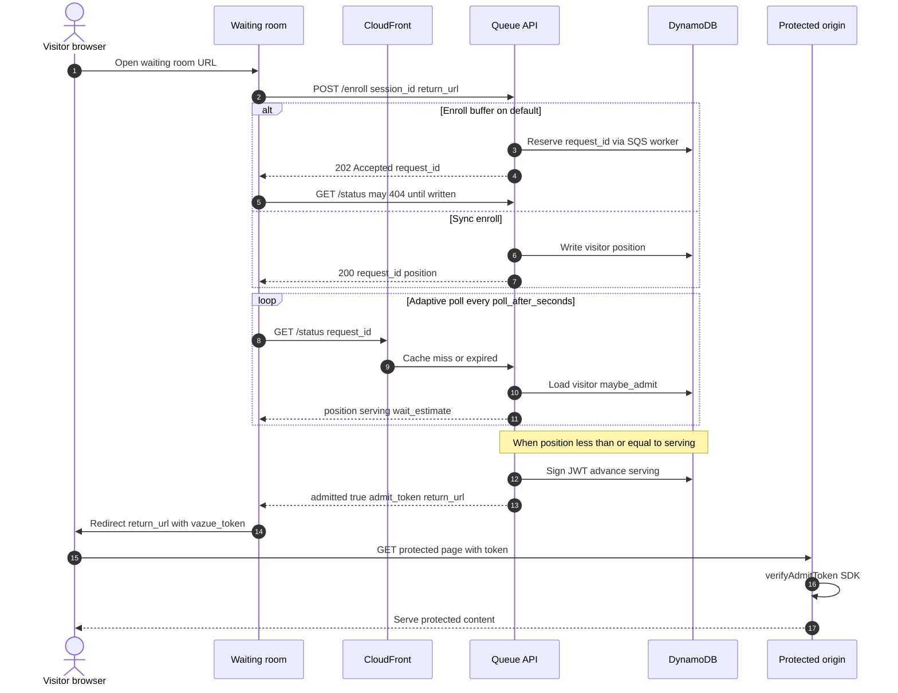
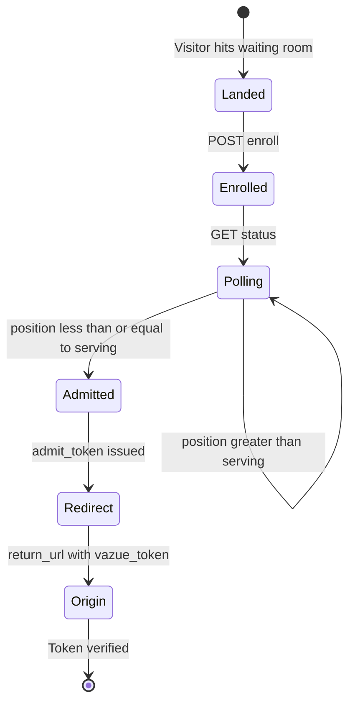
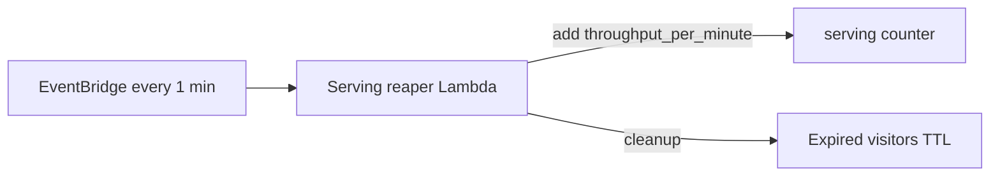

# Visitor flow

How a visitor moves from a marketing link to a protected site — step by step.

## Sequence diagram



::: tip Admit on GET status
The admit JWT is returned on **GET status** when `admitted=true`. A separate admit call is not required in the waiting room happy path.
:::

## Flow at a glance



## 1. Enroll

`POST /v1/events/{eventId}/enroll`

- Client sends `session_id` (cookie/localStorage), optional `return_url`, optional Turnstile token
- **Idempotent** by `session_id` — refresh does not lose position
- Assigns FIFO **position** via atomic counter
- With **enroll buffer** (default): returns **202** with pre-assigned `request_id`; worker writes visitor async

## 2. Status polling

`GET /v1/events/{eventId}/status?request_id=`

- Client sleeps `poll_after_seconds` between polls (adaptive: 2s / 5s / 30s based on distance from front)
- Response includes `position`, `serving`, `wait_estimate_minutes`
- **Admit token is returned here** when `admitted=true`
- `Cache-Control: public, max-age={poll_after_seconds}` enables CloudFront caching on `standard` preset
- **404** after buffered enroll means "still enrolling" — keep polling

| Distance from front | Poll interval |
|---------------------|---------------|
| &lt; 50 | 2 seconds |
| &lt; 500 | 5 seconds |
| else | 30 seconds |

## 3. Admit

Admission happens inside the status handler when `position <= serving` or `emergency_open`:

- Signs JWT via HS256 (`admit_token`)
- Advances `serving` counter
- Returns `return_url` from enroll or event config

`POST /admit` exists for edge cases but **prefer GET status** for the waiting room.

## 4. Redirect

Waiting room redirects to `return_url` with `?vazue_token=<JWT>`.

::: warning Preserve deep links
Pass the visitor's original destination as `return_url` on enroll. Do not replace it with a generic homepage.
:::

## 5. Origin verification

The protected application validates the JWT with `@yiu/queue-sdk` `verifyAdmitToken` (same HS256 secret as the data plane).

```typescript
import { verifyAdmitToken } from '@yiu/queue-sdk';

const claims = verifyAdmitToken(token, process.env.VAZUE_JWT_SECRET!);
if (!claims) {
  // redirect back to waiting room or return 403
}
```

On **`full` preset**, Lambda@Edge blocks requests without a valid token before they reach the origin.

## Serving advancement (background)



Operators can also pause, throttle, or open floodgates from the admin portal without redeploying.

See [Fairness & throughput](/docs/concepts/fairness-and-throughput) and [Architecture](/docs/concepts/architecture).
