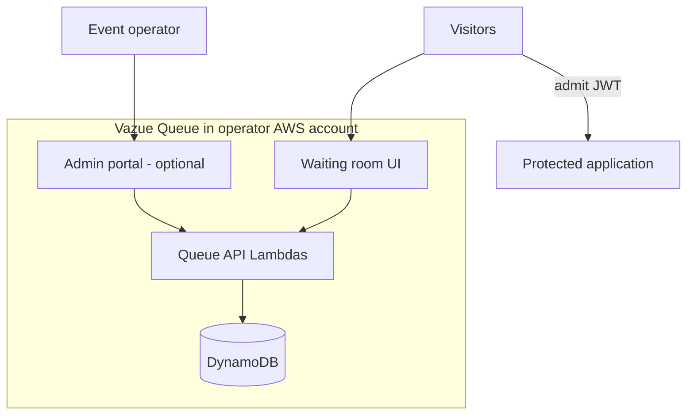

# Documentation

Vazue Queue is an **open source virtual waiting room** for AWS — fair FIFO admission, serverless cost profile, and admit tokens verifiable at the origin.

::: tip New here?
Unsure whether this is the right tool? Start with **[Why Vazue Queue](/docs/introduction/why-vazue)** — comparison vs other waiting rooms and DIY queues.
:::

## Deployment overview

| Component | Built with |
|-----------|------------|
| Fair FIFO waiting line | DynamoDB counters + Rust queue kernel |
| Visitor UI | Static waiting room on CloudFront |
| HTTP API | API Gateway + Lambda |
| Operator dashboard | Admin portal + Cognito (`full` preset) |
| Origin protection | JWT verification + optional Lambda@Edge |

Deploy with **`@yiu/queue-cdk`** into a dedicated AWS account.

## What to read first

1. [Why Vazue Queue](/docs/introduction/why-vazue) — how this compares to alternatives
2. [Architecture](/docs/concepts/architecture) — AWS bill of materials
3. [Visitor flow](/docs/concepts/visitor-flow) — enroll → poll → admit
4. [Quickstart](/docs/getting-started/quickstart) — deploy in ~10 minutes
5. [SDK examples](/docs/reference/sdks) — client + origin verification code
6. [Capacity planning](/docs/guides/capacity) — poller vs enroll baselines, Lambda soft quotas, load-test evidence
7. [AWS cost estimate](/docs/guides/cost) — model event spend before deploy

## Packages

| Package | Description |
|---------|-------------|
| `@yiu/queue-cdk` | Deploy the stack |
| `create-vazue-queue` | Scaffold + config wizard |
| `@yiu/queue-sdk` | TypeScript client + token verification |

Default AWS region: **us-east-1**.
