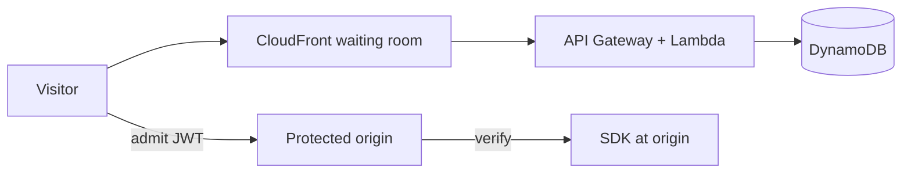

# Why Vazue Queue?

Flash events can overwhelm an origin before checkout, inventory, or payment APIs recover. This page compares **open source self-host**, **SaaS waiting rooms**, and **DIY queues** for teams evaluating virtual waiting rooms.

## Problem statement

| Need | Why it matters |
|------|----------------|
| **Fair admission** | First enrolled should not lose to someone who refreshes faster |
| **Origin protection** | Checkout, inventory, and payment APIs stay within capacity |
| **Cost at scale** | Flash traffic is spiky — always-on servers waste money between events |
| **Operator control** | Pause, throttle, emergency open, or dress rehearsal without a vendor ticket |

Vazue Queue is a **virtual waiting room**, not a job queue (SQS, RabbitMQ, Bull). It sits in front of a web application and controls **how many visitors enter at once**.

## Compared to managed waiting room services

| | Managed waiting room (SaaS) | Vazue Queue (self-host) |
|---|-------------------|-------------------------|
| **Billing** | Per visitor, per event, or platform fee | AWS bill (Lambda, DynamoDB, CloudFront) |
| **Data residency** | Vendor infrastructure | Operator AWS account and region |
| **Customization** | Vendor UI + config | Full source — theme waiting room, fork presets |
| **Time to first deploy** | Minutes (sign up) | ~10–30 minutes (CDK bootstrap + deploy) |
| **Ongoing ops** | Vendor SRE | Operator-owned CloudWatch, WAF, capacity planning |
| **Fairness model** | Vendor-specific | FIFO position + serving counter ([docs](/docs/concepts/fairness-and-throughput)) |

**Managed SaaS fits** when infrastructure ownership should be zero and vendor pricing is acceptable.

**Vazue Queue fits** when the stack already runs on AWS, Apache-2.0 source matters, and serverless economics suit occasional flash events.

## Compared to a custom implementation

A home-grown “queue” with Redis counters or a database table often covers enroll — but not the full product:

| Piece | DIY risk | Vazue Queue |
|-------|----------|-------------|
| FIFO under concurrent enroll | Race conditions, duplicate positions | Rust queue kernel + DynamoDB patterns |
| Waiting room UI | Build + host + localize | Static app on CloudFront (`standard` preset) |
| Adaptive polling | Fixed interval → expensive or stale | `poll_after_seconds` from API |
| Admit proof at origin | Ad-hoc cookies | HS256 JWT + SDKs (TypeScript, Go, Java) |
| Edge gate | Custom Lambda@Edge | `full` preset connector |
| Capacity honesty | Unknown until launch | [Published load tests](/docs/guides/capacity) |

**DIY fits** small scope (internal tool, hundreds of users) or a non-AWS runtime.

**Vazue Queue fits** when a maintained open source stack is preferable to rebuilding fairness, tokens, and UI before every launch.

## Included components

| Preset | Best for |
|--------|----------|
| `minimal` | API-only, custom UI, smallest footprint |
| `standard` | **Recommended** — waiting room + CloudFront status cache |
| `full` | Admin portal, WAF, Lambda@Edge origin gate |

[Presets detail →](/docs/concepts/presets)

## Evidence, not slogans

Load-test records are published with raw data — including what **default AWS quotas** supported before throttling:

- **~10,000** concurrent status pollers on a reference stack with **default account limits** (not a product maximum)
- **~1,000** simultaneous unique enrolls on `standard` with buffer (0% fail in reference runs)
- **~100,000** poller experiment — **AWS throttling** without quota increases, documented as exploratory

[Capacity guide →](/docs/guides/capacity)

## When not to use Vazue Queue

- **Not on AWS** — stack is CDK + Lambda + DynamoDB (+ CloudFront). No Kubernetes or multi-cloud preset today.
- **Need a work queue** — use SQS, Temporal, or similar for background jobs.
- **Require zero ops** — a managed waiting room service is a better fit.
- **Global sub-50ms status everywhere** — plan for cross-region RTT; edge caching helps polling but enroll is regional.

## Next steps

1. [Quickstart](/docs/getting-started/quickstart) — deploy to an AWS account
2. [Local development](/docs/getting-started/local-development) — run queue + admin APIs locally
3. [SDK examples](/docs/reference/sdks) — enroll, poll, verify admit token
4. [Open source self-host](/oss) — packages and license
